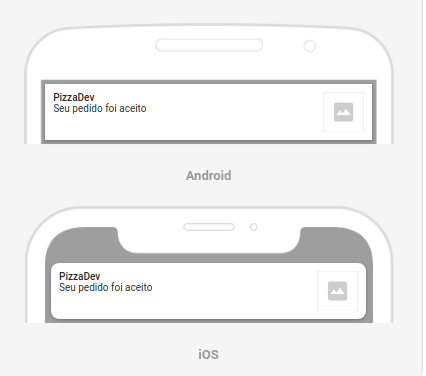

# RN Firebase - Firestore - FCM

<h1 align="center">
  
</h1>

## 📕 Índice

- [Sobre](#-sobre)
- [Tecnologias Utilizadas](#-tecnologias-utilizadas)
- [Como baixar o projeto](#-como-baixar-o-projeto)

## 🗒 Sobre
Aplicativo de estudo usando interações com FIREBASE (Cloud Firestore e Cloud Messaging)

## 🚀 Tecnologias utilizadas

- React Native
- TypeScript
- Firebase (Cloud Firestore e Cloud Messaging)

## 📥 Como baixar o projeto
---